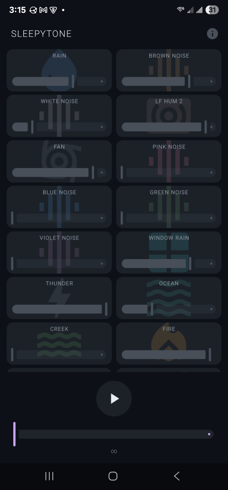

<h1 align="center">SleepyTone</h1>

<p align="center">
  <a href="LICENSE"></a>
  <a href="https://developer.android.com/"></a>
  <a href="https://github.com/Liddo-kun/chromatone/releases"></a>
</p>

<p align="center">
  Ambient noise and sound mixer for sleep, focus, and relaxation.<br>
  <b>No ads. No tracking. No internet required.</b>
</p>

<p align="center">
  
</p>

---

## What is SleepyTone?

SleepyTone mixes procedural noise generators with ambient sound loops through a single audio pipeline, giving you glitch-free layering with per-source volume control.

**25 sounds to mix:**

| Noise Generators | Ambient Loops |
|---|---|
| White, Pink, Brown | Rain, Window Rain, Thunder |
| Green, Blue, Violet | Ocean, Creek, Fire |
| | Crickets, Toads, Whale (x2) |
| | Fan, AC, Airplane |
| | Cat Purring, Purring 2 |
| | 5 Hz Brainwave, LF Hum (x2) |
| | Melody |

All noise is generated on-device. Ambient loops are decoded once and cached for instant playback on subsequent launches.

---

## Features

- **Sound mixing** -- combine any number of sources with individual volume sliders
- **Sleep timer** -- set up to 8 hours, countdown visible in the header
- **Background playback** -- runs as a foreground service, keeps playing when you leave the app
- **Dark UI** -- designed for bedtime use
- **Offline** -- everything runs locally, no network calls
- **Tiny footprint** -- under 10 MB APK, minimal battery drain

---

## Install

Download the latest APK from [Releases](https://github.com/Liddo-kun/chromatone/releases) and sideload it. Android 8.0+ (API 26) required.

## Build from source

```sh
git clone https://github.com/Liddo-kun/chromatone.git
cd chromatone
./gradlew assembleRelease
```

The signed APK is output to the project root as `chromatone-release.apk`.

---

## Privacy

- No analytics, no tracking, no network code
- No data leaves your device
- Only requires audio, notification, and backup permissions
- Open source -- review the code anytime

---

## License

MIT License. See [LICENSE](LICENSE) for details.
